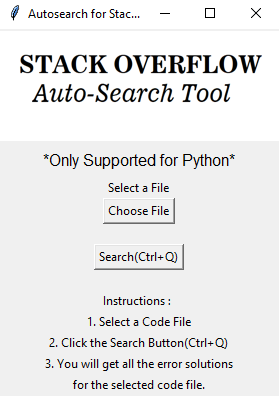

# AutoSearch for StackOverflow

## Project Description

A Python application that allows users to select a Python code file, run it, and automatically search for solutions to any errors on Stack Overflow.

## Features

- Select a Python code file
- Run the code and detect errors
- Automatically search for solutions on Stack Overflow
- Open relevant Stack Overflow pages in the default web browser
- Supports keyboard shortcut (Ctrl+Q) for searching

## Requirements

- Python 3.8+
- Tkinter library
- PIL library
- requests library
- webbrowser library

## Installation Steps

1. Clone or download the repository to your local machine.
2. Make sure you have Python 3.x installed.
3. Install all the requirements 

## Usage 
1. Run main.py -> python main.py
2. Click the "Choose File" button to select the Python code file you want to search for errors.
3. Click the "Search" button or press Ctrl+Q to automatically search StackOverflow for solutions to any errors found in the selected file.

## License

MIT License

## Contributors

* [Sarth Patil](https://github.com/sarthpatil8)

## Preview

